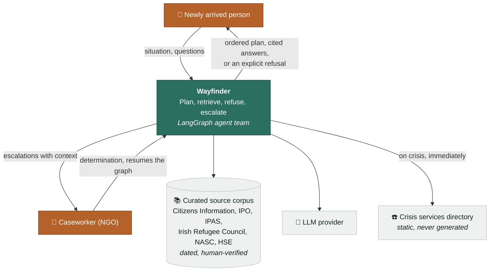
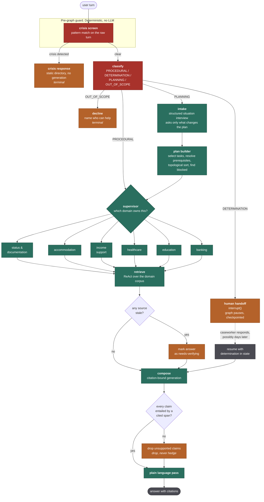
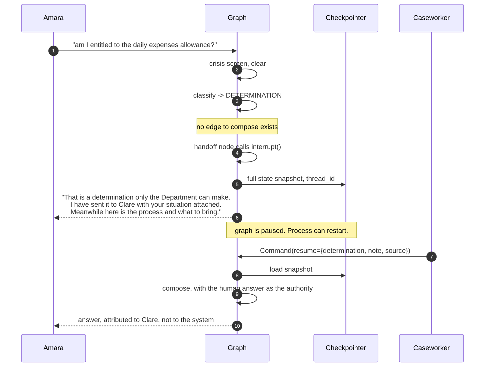

# 04. High-Level Design

**Project:** Wayfinder · **Version:** 1.0 · **Date:** 17 August 2026

---

## 1. What shapes this architecture

| # | Driver | Consequence |
|---|---|---|
| D1 | Some questions must never be answered by the system | Classification happens **before** routing, and the refusal path cannot be reached by the answering path |
| D2 | Crisis situations must bypass everything | A pre-graph deterministic check, not a node the supervisor might route around |
| D3 | Tasks have prerequisites | The planner emits a **DAG**, and ordering is computed rather than generated |
| D4 | A human handoff may take days | `interrupt()` plus a durable checkpointer, not a blocking call |
| D5 | Every claim needs a dated source | Generation is constrained to retrieved spans, and verified afterwards |

**The single most important structural decision:** the safety classifier sits
*outside and above* the agent graph. An LLM supervisor deciding whether to
escalate is a supervisor that can be talked out of escalating. The crisis check
and the determination check run first, deterministically, and the graph is only
entered if they pass.

---

## 2. System context

Note the arrow that does not exist: Wayfinder never contacts an agency on
someone's behalf. Actions with consequences stay with the person and their
caseworker (PDD NG4).

---

## 3. The graph

### 3.1 Reading the graph

Three things are worth noticing.

**The guard is outside the graph.** `crisis screen` runs on the raw turn before
LangGraph is entered. It is deterministic pattern matching. If it fires, the
response comes from a static directory with no generation at all, because a
model improvising during someone's emergency is unacceptable and a model is not
needed to read out a phone number.

**`DETERMINATION` cannot reach `compose` without passing through `handoff`.**
There is no edge. The only route from a determination question to an answer runs
through a human, and that is a property of the graph rather than of a prompt.

**`compose` is the only node that generates prose**, and its output is verified
before it leaves. Unsupported claims are dropped rather than softened, because
"you may possibly be entitled to" is still an entitlement claim.

---

## 4. Why supervisor rather than swarm

Current guidance is to start with a supervisor: one routing node, clear control
flow, every decision visible in a trace. Swarms need budget limits, handoff
schemas, loop detection and tool isolation before they are safe to run.

For this domain the argument is stronger than "start simple". **In a swarm, any
agent can hand off to any other, which means the set of reachable paths is large
and hard to enumerate.** Here we need to be able to say with certainty that no
path exists from a determination question to a generated answer. A supervisor
with explicit edges makes that checkable. A swarm makes it an argument.

Domain agents are subgraphs rather than separate agents in a mesh: they retrieve
within their domain and return, and they never route to each other.

---

## 5. Components

| Component | Owns | Explicitly not its job |
|---|---|---|
| **Crisis screen** | Detecting emergencies in the raw turn | Anything else. It has one job and must be fast and dumb |
| **Classifier** | Deciding what kind of question this is | Answering it |
| **Intake** | Building a structured situation | Guessing missing facts. It asks |
| **Plan builder** | Task selection, prerequisites, ordering, blocked detection | Generating prose about tasks |
| **Supervisor** | Routing to a domain | Retrieval or generation |
| **Domain subgraphs** | ReAct retrieval within one domain | Cross-domain reasoning |
| **Composer** | Turning retrieved spans into an answer | Introducing facts not in the spans |
| **Verifier** | Checking every claim against its span | Fixing bad claims. It removes them |
| **Handoff** | Pausing, packaging context, resuming | Deciding the determination |
| **Corpus** | Dated, curated sources | Being complete. It is explicitly partial and says so |

---

## 6. State and persistence

LangGraph's checkpointer is what makes the human handoff real rather than
decorative. When `interrupt()` fires, the executor serialises the full state
snapshot under the thread id and unwinds cleanly. The process can restart. The
caseworker can respond on Thursday. `Command(resume=...)` picks up exactly where
it stopped.

The final message attributes the determination to the named human. The system
does not launder a human judgement into its own voice.

---

## 7. Stack

| Layer | Choice | Why |
|---|---|---|
| Orchestration | **LangGraph 1.x** | The gap this project exists to close. `interrupt()`, checkpointers and durable execution are exactly what the handoff needs |
| Checkpointer | `langgraph-checkpoint-sqlite` dev, `-postgres` deploy | Durable pause is the point |
| Language | Python 3.12 | |
| Models | Small fast model for classification, stronger model for supervisor routing and composition | Routing needs reasoning; classification needs consistency and low latency |
| Retrieval | Hybrid BM25 + embeddings over a curated corpus | The corpus is small and high-value, so precision beats recall |
| Validation | Pydantic v2 | State schemas, task model, citations |
| API/UI | FastAPI plus server-rendered pages | Same reasoning as any small tool: no build step, fewer places for escaping bugs |
| Quality | ruff, mypy --strict, pytest, plus a **safety eval gate in CI** | The classifier is a model and gets treated like one |

---

## 8. Cross-cutting

| Concern | Approach |
|---|---|
| **Personal data** | Not persisted by default. Situation lives in graph state for the thread and is purged on completion. Escalations carry the minimum a caseworker needs |
| **Citations** | A first-class type, not a string. `Citation(source_id, title, url, span, last_verified)` |
| **Staleness** | Every source dated. Past threshold, the answer is downgraded and says so |
| **Refusals** | Always name an alternative. A refusal that leaves someone stuck is a failure, not a safety win |
| **Tracing** | Every turn traceable: classification, route, sources, verification result. Needed for eval and for anyone reviewing a bad answer |
| **Reading level** | Measured, targeted, tested. Guidance nobody can read is not guidance |
| **Tone** | The output is read by someone under stress. No cheerfulness, no exclamation marks, no false reassurance |

---

## 9. What this design refuses to do

- No path from a determination question to a generated answer.
- No LLM in the crisis path.
- No generated content in a crisis response.
- No claim without a dated citation.
- No hedged version of a claim that failed verification. It is removed.
- No action taken on anyone's behalf.
