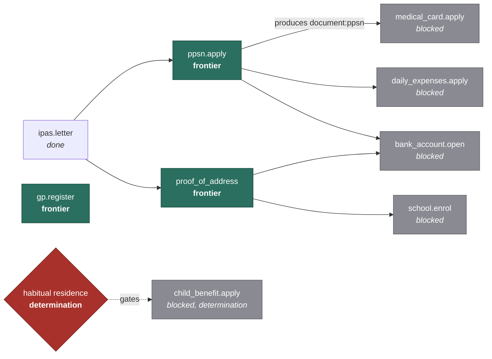

# 06. The plan graph

**The first of two core contributions.** Read this and `07-safety-and-escalation.md`
if you read nothing else.

---

## 1. Why a graph and not a list

Ask a general-purpose model "what do I need to do after arriving in Ireland as an
asylum seeker" and you get a competent-looking bulleted list. The list is close
to useless, because it does not tell you the thing that actually costs people
weeks: **which of these you cannot start yet, and what specifically unblocks it.**

Real examples of the structure:

- Most welfare applications require a **PPS number**.
- Getting a PPSN generally requires evidence of identity and of address or of
  being in the protection process.
- Address evidence often depends on **accommodation being allocated**, which is
  not something the person controls.
- School enrolment usually wants proof of address.
- A bank account typically wants photo ID plus proof of address.
- Some payments are gated on a **habitual residence** determination, which is a
  decision by a named authority and not something a person can simply do.

So the plan is a directed acyclic graph with typed edges, and the useful output
is not the list of tasks but the **frontier**: what can be started today, what is
blocked, and by exactly what.

---

## 2. The task model

**Revised in M1, see `12` §5 and §6.**

```python
TaskId = Annotated[str, StringConstraints(pattern=r"^[a-z0-9_]+(\.[a-z0-9_]+)+$")]

# The prefix is the kind. task:, document:, status:, determination:, elapsed:
ArtefactRef = Annotated[str, StringConstraints(pattern=...)]

class Prerequisite(BaseModel):
    """One requirement, satisfied by any one of `any_of`."""
    any_of: tuple[ArtefactRef, ...]     # length 1 is a hard requirement
    after: timedelta | None = None      # only alongside an elapsed: reference
    note: str = ""

class Task(BaseModel):
    id: TaskId
    title: str                  # plain language, imperative
    domain: Domain
    why: str                    # one sentence. people follow steps they understand
    requires: tuple[Prerequisite, ...]   # an AND of ORs
    produces: tuple[ArtefactRef, ...]
    applies_when: Condition     # three-valued, see section 4
    where: tuple[SourceSpan, ...]        # at least one, resolved against a dated source
    typical_wait: timedelta | None
    blocking_severity: Severity
```

Three fields carry most of the value.

**`produces`** is what makes the graph resolvable. A task is not just a step, it
yields artefacts: `ppsn.apply` produces `document:ppsn`. Another task requiring
`document:ppsn` is then linked automatically, so prerequisites are declared
against *artefacts* rather than hard-wired to task ids. Adding an alternative
route to the same document does not require rewiring every dependent.

**`requires` is an AND of ORs.** The design originally expressed alternatives
with a flat `optional: true` flag, which cannot say *which* alternatives belong
together. Computing a minimal unblocking route needs exactly that, so each
`Prerequisite` carries its own set of acceptable artefacts.

**`applies_when`** is why this cannot be a static checklist. Someone with status
granted has a materially different plan from someone awaiting a decision.

The kind is carried once, by the prefix on the reference, and derived from it at
load. Carrying it twice, as a `kind:` field beside a prefixed `ref:`, gives a
corpus contributor two places to state one fact and eventually they disagree.

A task may not declare `determination:` in `produces`. That is ADR-0004 pushed
down into the corpus: without it, a contributor could write a task that marks a
legal determination satisfied by somebody filling in a form.

## 3. Prerequisite kinds, and why `determination` is separate

| Kind | Meaning | Who can clear it |
|---|---|---|
| `task` | Another task must complete | The person |
| `document` | An artefact must exist | The person, by completing a producing task |
| `elapsed_time` | A waiting period | Nobody. Time |
| `status` | A status change | An authority |
| **`determination`** | **An authority must decide something** | **Not the person, and never this system** |

`determination` exists as its own kind for one reason: it is the boundary the
system must not cross. When a task is blocked on a determination, the correct
output is "this is decided by *named authority*, here is how it is applied for,
here is who can help you with it", never an assessment of whether it will go your
way. The type system carries the safety rule, so a contributor adding a task
cannot accidentally imply otherwise.

---

## 4. Situation, and asking only what matters

**Revised in M1, see `12` §2 and §5.**

```python
class Situation(BaseModel):
    arrival_date: date | None
    protection_application_date: date | None   # not the same day as arrival
    protection_stage: ProtectionStage | None
    accommodation: Accommodation | None
    household: Household | None

    held: frozenset[ArtefactRef]               # known to have
    known_absent: frozenset[ArtefactRef]       # known not to have
    tasks_completed: frozenset[TaskId]
    determinations: Mapping[ArtefactRef, DeterminationRecord]
```

Everything is optional and nullable on purpose. Intake asks for a field **only
when it changes the plan**, computed as information gain over the candidate task
set rather than by walking a fixed questionnaire. Somebody in distress should not
be interviewed for twenty minutes before getting anything useful.

The rule: if two candidate plans are identical whichever way a field resolves,
do not ask.

### 4.1 Why knowledge is three-valued

`held` and `known_absent` are separate sets rather than one set plus an absence
rule. Anything in neither is genuinely **unknown**.

This matters more than it looks. Under two-valued logic an unasked question
reads as a negative answer, and the plan silently asserts something about
somebody that nobody told it. Conditions therefore evaluate under Kleene K3 to
TRUE, FALSE or UNKNOWN, and a task whose applicability is UNKNOWN lands in a
fourth partition, `needs_info`, rather than being guessed either way.

It is also what makes "ask only what changes the plan" a computation. Each
condition reports the facts that would move it off UNKNOWN, and reports nothing
once the result is decided, so the candidate question set is already pruned to
questions that matter.

### 4.2 Determinations are not questions

`determinations` can only hold a record naming the authority that decided, with
a date. There is no default and no way to construct one anonymously, and the
plan engine has no code path that writes to it.

An undecided determination is therefore **never** offered as an open question.
"Do you satisfy the residence test?" is exactly the question this system must
not put to somebody: listing it as a gap to be filled invites an answer from the
person, or later from a model, standing in for a decision only an authority can
make. It is a blocker to be named, not a gap to be filled.

## 5. Building the plan

```
1. select      tasks whose applies_when matches the situation
2. close       pull in prerequisite-producing tasks transitively
3. resolve     link `requires` to `produces` across the selected set
4. validate    assert acyclic. a cycle is a corpus bug, and it must fail loudly
5. sort        topological order, tie-broken by blocking_severity then wait time
6. partition   done / frontier / blocked / needs_info
7. explain     for each blocked task, its unblocking route and next actions
```

Step 4 matters. A cycle means the modelled prerequisites are wrong, which is a
content error a maintainer must fix. Silently breaking the cycle would produce a
plan that looks fine and sends someone in a circle.

Step 7 is the output people actually want.

### 5.1 The unblocking route, and the next actions

**Revised in M1. The formula previously given here was wrong, see `12` §3.**

Two different things get conflated by the phrase "minimal unblocking set", and
both are needed.

**`unblocking_route(t)`** is the smallest set of tasks, at any status, whose
completion makes `t` startable, minimised over alternative routes where a
requirement can be met more than one way.

**`next_actions(t)`** is the part of that route which can be started today. This
is the sentence a person actually reads: "start these two now".

The earlier formula, the set of frontier tasks that are ancestors of `t`, is
both too big and too small. Too big because it is the very superset this section
goes on to reject. Too small because completing the frontier ancestors does not
unblock `t`: the tasks between them and `t` still have to happen.

Worth being honest about the cost. Requirements form an AND of ORs, so this is
minimum-cost solving over an AND/OR graph, which is NP-hard in general. The
implementation is exact rather than greedy, keeping every Pareto-minimal
candidate and taking the smallest, because a greedy choice per alternative is
not globally optimal when two alternatives share a sub-task. That is affordable
at corpus scale, and a hard bound guards the assumption. Breaching the bound
raises rather than quietly returning an answer that might not be minimal.

### 5.2 Worked example

Situation: applied for protection two weeks ago, in IPAS accommodation, no PPSN,
one child aged 7.



Output:

> **Start now:** apply for your PPS number, get proof of address from IPAS,
> register with a GP.
>
> **`ppsn.apply` is the one that matters most.** Four other things are waiting on
> it.
>
> **Child benefit** is blocked on a habitual residence decision. That is decided
> by the Department of Social Protection, not by you and not by me. Here is how
> it is applied for, and here is who can help you with it.

That last paragraph is the project in miniature: name the blocker, name the
authority, refuse to assess it, and still be useful.

---

## 6. Critical path

**Revised in M1, see `12` §4.**

Two quantities, kept separate on purpose.

**Gated calendar time** is computed: for each frontier task, the longest chain of
waiting time it stands at the head of. A standard longest-path computation over
the DAG with `typical_wait` as the node weight. This is what "leaving this costs
the most calendar time" actually means, and it is why a task unblocking two
things over four weeks should beat one unblocking three things in a day. A count
of descendants does not express that; the longest path does.

**Severity** is an editorial judgement about what being blocked costs somebody.

The frontier is ordered by severity band first, then by gated time within the
band. Ordering on gated time alone puts a ten day language class above a seven
day application for a medical card: both gate nothing downstream, so the
computation has nothing to say and the order falls to an accident of duration.
Combining the two into one number needs weights nobody can defend, so they stay
separable, with the judgement as the coarse band and the computation as the
ordering inside it.

Note that this ordering is not the topological one. Topological order says what
is *valid*; the frontier order says what to do first.

This is why the plan is worth computing rather than generating. "Do this one
first, because four things are waiting on it and it takes three weeks" is
derived from structure, and a language model has no reliable way to work it out
from prose.

## 7. Replanning

Situations change: status granted, accommodation moved, PPSN arrives. Replanning
is a fresh build plus a **diff against the previous plan**:

- newly unblocked, which is the good news and should lead
- newly applicable, because status changes bring new entitlements
- no longer applicable, which needs care in wording since a task disappearing can
  read as something being taken away
- still blocked, and whether the blocker changed

The diff is the output, not the new plan. Somebody six months in does not want
their forty-item list again.

---

## 8. Why the corpus is hand-curated in v1

Every task, prerequisite and citation is written by a person against a named
source with a verification date. That is slow and it is the right call:

- A wrong prerequisite sends someone on a wasted journey they cannot afford.
- Scraped agency pages are conditional and cross-referenced in ways that defeat
  naive extraction.
- Task granularity is an editorial judgement. "Apply for a PPSN" is one task, not
  seven, because that is how a person experiences it.

Automated ingestion is v1.2, and it should propose changes for human review
rather than write directly to the corpus.

---

## 9. Testing

| What | How |
|---|---|
| Acyclicity | Property test over generated situations. Any cycle fails the build |
| Ordering | Reference plans for ~12 hand-built personas, asserted exactly |
| Unblocking sets | Asserted minimal, since a superset is technically correct and practically useless |
| `applies_when` | Table-driven across the situation space |
| Determination tasks | Assert none can ever be marked complete by the system |
| Replanning | Snapshot diffs across a scripted timeline for one persona |
| Corpus integrity | Every task cites at least one source; every source has a date; no orphan `requires` |
