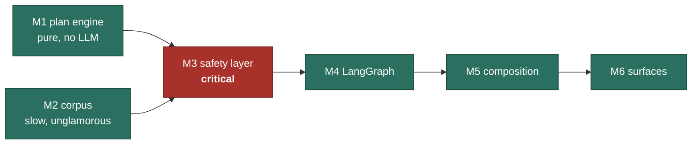

# 08. Roadmap

**Project:** Wayfinder · **Date:** 17 August 2026

Assumption: solo, part-time, roughly 10 to 14 hours a week. Estimates are focused
hours. Total for M1 to M6 is about **120 hours**, so 9 to 12 weeks at that rate.

**The sequencing rule:** the safety layer ships before the thing it protects.
Building the agent first and adding guardrails later produces a system whose
guardrails are an afterthought, and it always shows.

---

## Status, 19 August 2026

| M | State | Note |
|---|---|---|
| M1 Plan graph engine | Built | The design was wrong in six places. `12-changes-from-design.md` |
| M2 Corpus and retrieval | Built | 20 tasks, 8 verified sources, 17 artefacts. The design's ~40 tasks are not there |
| M3 Safety layer | Built, gate unmet | The deterministic screen scores 0.167 held out. ADR-0008 |
| M4 LangGraph assembly | Built | The topology proof had to be replaced. ADR-0007 |
| M5 Composition | Built | Extractive, not generative. The `Composer` protocol takes a model and nothing implements it |
| M6 Surfaces | Built | API, caseworker queue, corpus alarm, CLI, Docker, demo script |

Two of the design's headline safety claims turned out to be unprovable as
written, and both were fixed in the design rather than in the test. That is the
most useful thing this project produced.

The sequencing rule held with one deliberate exception: M3 was built before M2,
because the safety layer needs no corpus and the corpus benefits from knowing
what the classifier will ask of it.

---

## M1. Plan graph engine (~22 h)

Pure Python, no LLM, no framework. The part that survives everything else.

| Task | Est |
|---|---|
| Scaffold: uv, ruff, mypy strict, pytest, import-linter contract, CI | 3 h |
| Task, Prerequisite, Situation, Plan models | 3 h |
| Corpus loader with integrity validation, mandatory dates | 3 h |
| Builder: select, close, resolve, validate acyclic, topological sort | 5 h |
| Minimal unblocking sets | 3 h |
| Replanning diff | 2 h |
| Reference personas and exact-assertion tests | 3 h |

**Demo:** a real situation in, a real ordered plan out, with the critical path
named. No model involved, which is itself the point worth making.

---

## M2. Corpus and retrieval (~20 h)

| Task | Est |
|---|---|
| Curate ~40 tasks across six domains, every one cited and dated | 10 h |
| Source records with `last_verified`, verification pass | 3 h |
| Hybrid BM25 plus embedding index | 4 h |
| Staleness bands and the corpus health report | 3 h |

The 10 hours of curation is the least glamorous and most load-bearing work in the
project. Do not compress it.

---

## M3. Safety layer (~24 h). The milestone that matters

| Task | Est |
|---|---|
| Crisis lexicon and services directory, curated and dated | 4 h |
| Deterministic crisis screen | 2 h |
| Deterministic determination markers | 3 h |
| LLM classifier layer with constrained schema | 3 h |
| **Labelled corpus: crisis, determination, procedural, boundary, adversarial** | 8 h |
| Eval harness, metrics, CI gate against a committed baseline | 4 h |

**Demo:** the minimal pairs. "What are the conditions for the habitual residence
condition?" is answered with citations. "Do I satisfy the habitual residence
condition?" is refused, escalated, and still useful.

Do not compress the `boundary` split. Precision on procedural questions is
meaningless without hard negatives.

---

## M4. LangGraph assembly (~24 h)

| Task | Est |
|---|---|
| State schema and checkpointer wiring | 3 h |
| Intake node with information-gain question selection | 4 h |
| Supervisor and routing | 3 h |
| Six domain subgraphs as bounded ReAct loops | 6 h |
| Handoff node with `interrupt()`, plus resume | 4 h |
| **Graph topology test: assert the forbidden paths do not exist** | 2 h |
| Restart-mid-pause test | 2 h |

**Demo:** ask a determination question, watch the graph pause, kill the process,
restart it, answer as the caseworker, watch it resume and attribute the answer to
the named human.

---

## M5. Composition and verification (~18 h)

| Task | Est |
|---|---|
| Citation-bound generation | 4 h |
| Entailment verification that drops unsupported claims | 5 h |
| Staleness downgrade behaviour | 3 h |
| Plain-language pass with a measured reading level | 4 h |
| Refusal templates that always name an alternative | 2 h |

---

## M6. Surfaces (~14 h)

| Task | Est |
|---|---|
| FastAPI: threads, turns, plan view | 5 h |
| Caseworker queue and respond endpoint | 4 h |
| Corpus health page | 2 h |
| Docker compose, README, demo script | 3 h |

---

## Critical path and what will go wrong

| Risk | Signal | Response |
|---|---|---|
| Corpus curation overruns | M2 passes 14 h with under 25 tasks | Cut to four domains. Depth beats coverage, and a thin corpus that is correct beats a broad one that is not |
| The boundary split is harder than expected | Determination recall stuck below 0.97 | Strengthen the deterministic markers rather than reaching for a bigger model. Layer 2 is where this should be solved |
| LangGraph API drift | Something in the docs does not match the installed version | The installed version wins. Check the current reference and update the design doc, noting what changed |
| Scope creep into case management | "It would be easy to add reminders" | PDD §5.2 exists for that moment |

---

## Post v1

| Version | Item |
|---|---|
| v1.1 | Multilingual output, with its own safety eval per language |
| v1.2 | Assisted corpus ingestion, proposing changes for human review |
| v2 | Second jurisdiction, which is the real test of whether the plan engine is jurisdiction-agnostic |
| v2 | Voice interface |
